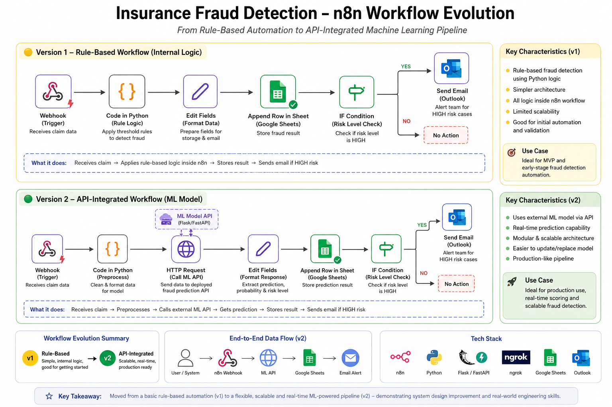

# 🚨 Insurance Fraud Detection Pipeline (n8n)


---

## 📌 Overview

This project is a hands-on attempt to build a real-time fraud detection pipeline using n8n, focusing on how fraud detection systems work beyond just model building.  

Instead of only building a prediction model, this project simulates a complete pipeline — from data ingestion to alerting and storage.

---

## 💡 Why I built this

While working on fraud analytics, I realized that building a model is only one part of the process.
In real scenarios, there’s always a pipeline around it.

This project helped me understand:

* how data flows in real time
* how fraud decisions are applied
* how alerts and reporting are handled

---

## ⚙️ What this pipeline does

* Accepts claim data via webhook
* Applies fraud logic using Python (inside n8n)
* Classifies risk as **HIGH / MEDIUM / LOW**
* Sends Outlook email alerts for **high-risk claims**
* Stores all records in Google Sheets
* Adds timestamps for tracking and analysis

---
## 🧩 Workflow Architecture & Evolution

The pipeline was built in two stages — starting with rule-based logic and then evolving into an API-integrated architecture.



This evolution highlights the transition from internal rule-based processing to a scalable, API-driven fraud detection system.


## 🔄 Workflow
version-1
```plaintext
Webhook → Python Logic → Timestamp → Google Sheets → High Risk Alert (Outlook)
```
Version-2
```plaintext
Webhook → HTTP Request (ML API) → Data Formatting → Google Sheets → IF Condition → Outlook Alert → Google Sheets (Final Log)
```
---

## 📸 Screenshots

### 🔹 Workflow
Version-1


version-2 (API enabled)


### 🔹 Email Alert


### 🔹 Google Sheets Output


---

## 📊 Sample Input

```json
{
  "Claim_ID": "C101",
  "Fraud_Probability": 0.85,
  "Fraud_Label": 1
}
```

---

## 📈 Output Fields

* Predicted_Fraud
* Risk_Level
* Timestamp

---

## ⚠️ Challenges I faced

* Understanding data flow between nodes in n8n
* Handling type consistency for IF conditions
* Working around Python node limitations (no external imports allowed)
* Fixing Google Sheets column sync issues after schema updates

---
## ✅ Results

* Successfully simulated real-time fraud detection workflow  
* High-risk claims trigger automated email alerts  
* All transactions logged for analysis and reporting  
* Pipeline designed to be easily extended for real-world use cases
  
---
## 🛠 Tech Stack

* n8n
* Python (Code node)
* Microsoft Outlook
* Google Sheets

---

### Key Improvements from v1 → v2

- Moved from rule-based logic to model-driven predictions  
- Introduced API layer for scalability and modularity  
- Enabled real-time fraud scoring  
- Improved system design closer to production environments

  ---
 ## 🚀 Future Improvements

* Build an interactive dashboard using Power BI or Tableau for fraud trend analysis and reporting  
* Automate data ingestion from Outlook emails or SharePoint uploads to eliminate manual triggering  

## 📬 Feedback

Open to feedback and suggestions to improve this pipeline further.

---

## 👤 Author

Twinkle Grover
(Data Analyst | Fraud Analytics | Automation)
